# Эллиптические кривые

$Y^2 = X^3 + A \cdot X + B$ - уравнение эллиптической кривой в форме Вейерштрасса.

$\Delta = -16(4A^3 + 27B^2)$


```python
F = RR
A.<x,y>=F[]
```


```python
C=Curve(y^2-x^3)
C.plot()
```


    
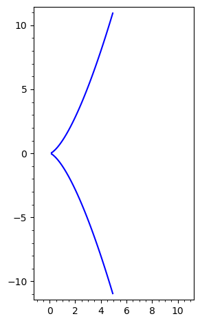
    


```python
b = 1
a = -(27 * b^2 / 4)^(1/3).n()
C=Curve(y^2 - x^3 - a * x - b)
C.plot()
```


    
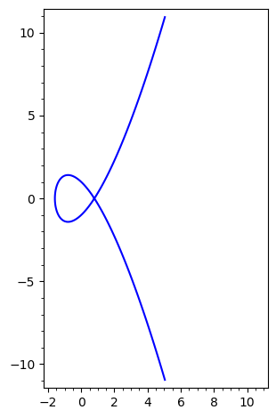
    


```python
E = EllipticCurve(RR, [0, 3])
E.plot(xmin=-5, xmax=4, ymin=-4, ymax=4)
```


    
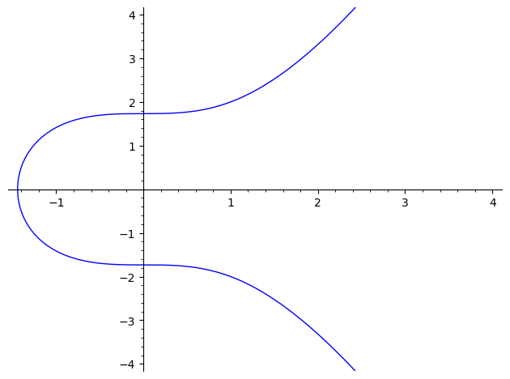
    


```python
E = EllipticCurve(RR, [-2.457, 2.2])
E.plot(xmin=-5, xmax=4, ymin=-4, ymax=4)
```


    
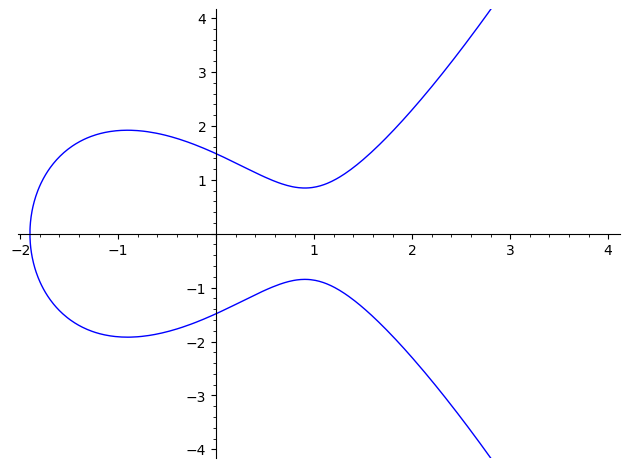
    


```python
E = EllipticCurve(RR, [-1.754, 0.8])
E.plot(xmin=-5, xmax=4, ymin=-4, ymax=4)
```


    
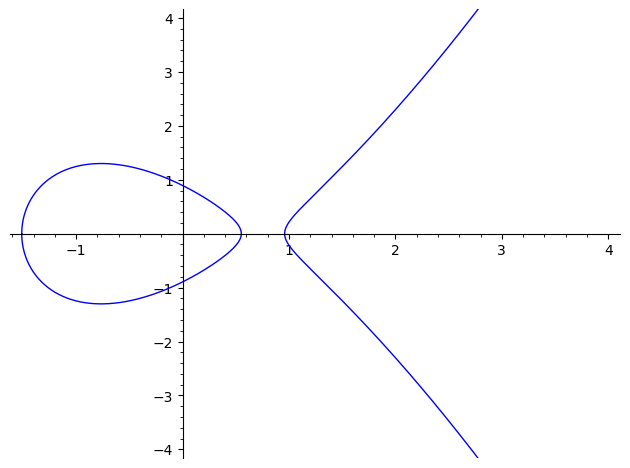
    


## Теперь рассмотрим как прямая может пересекать эти кривые


```python
E = EllipticCurve(RR, [-5, 6])
Eplot = E.plot(xmin=-5, xmax=10, ymin=-5, ymax=5)
x = var('x')
Eplot
```


    
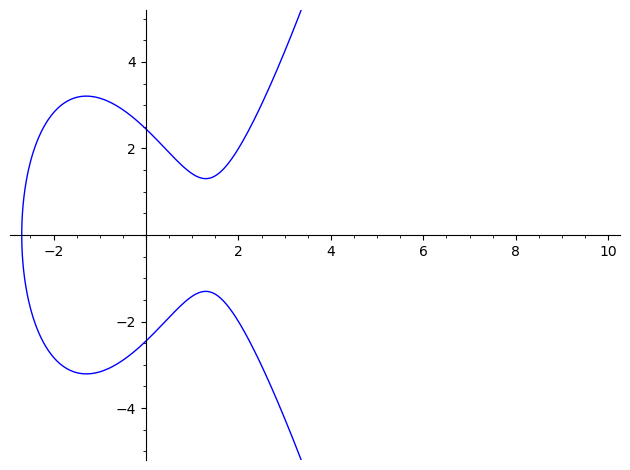
    


```python
P = E.lift_x(-2.0)
Q = E.lift_x(0.0)
R = -(P + Q)
l = RR(P[1] - Q[1]) / RR(P[0] - Q[0])
y1 = l * (x - P[0]) + P[1]
Eplot + P.plot(color='red', size=30) + Q.plot(color='green', size=30) + R.plot(size=30)  + y1.plot(xmin=-3, xmax=10, color='red')
```


    
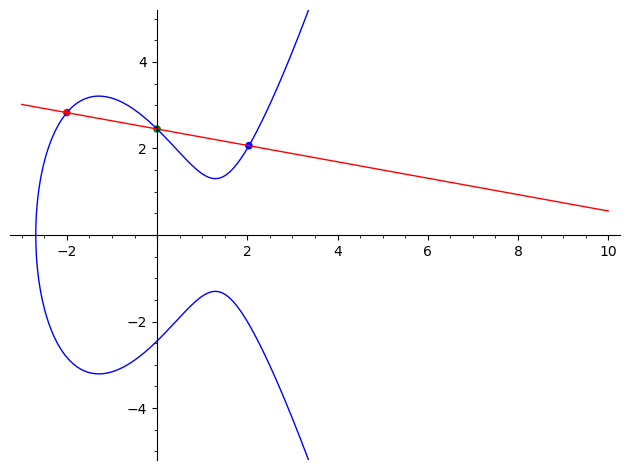
    


```python
P = E.lift_x(-1.0)
R = -(P + P)
l = RR(3 * P[0]^2 - 5) / RR(2 * P[1])
y1 = l * (x - P[0]) + P[1]
Eplot + P.plot(color='red', size=30) + R.plot(size=30)  + y1.plot(xmin=-3, xmax=10, color='red')
```


    
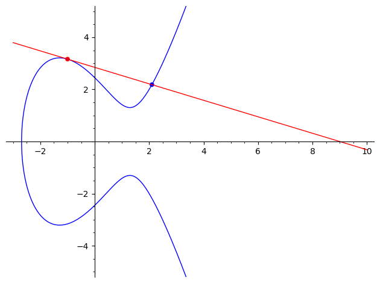
    


```python
xl = (x^3 - 5 * x + 6).roots()[1][0].n()
P = E.lift_x(xl)
Eplot + line([(xl, -5), (xl, 5)], color='red') + P.plot(size=30, color='red')
```


    
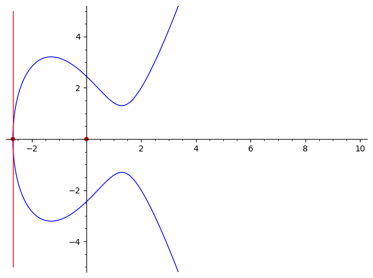
    


## Сложение точек

$P = (x_p, y_p)$
- $Q = O$  => $P + Q = P$
- $Q = (x_p, -y_p)$ => $P + Q = O$ 
- $Q \ne P$ => $\lambda = \frac{y_p - y_q}{x_p - x_q}$
- $Q = P$ => $\lambda = \frac{3 * x_p^2 + A}{2 * y_p}$

$x_r = \lambda^2 - x_p - x_q$

$y_r = \lambda(x_p - x_r) - y_p$

Проверка:


```python
xp, xq, a, b, = var("xp xq a b")
yp = sqrt(xp^3 + a * xp + b)
yq = sqrt(xq^3 + a * xq + b)

lam = (yp - yq) / (xp - xq)
xr = lam^2 - xp - xq
yr = lam*(xp - xr) - yp

left = yr^2
right = xr^3 + a * xr + b
assert factor(left - right) == 0

lam = (3 * xp^2 + a) / (2 * yp) 
xr = lam^2 - xp - xp
yr = lam*(xp - xr) - yp
left = yr^2
right = xr^3 + a * xr + b

assert factor(left - right) == 0
```


```python
P = E.lift_x(-2.0)
Q = E.lift_x(0.0)
R = -(P + Q)
l = RR(P[1] - Q[1]) / RR(P[0] - Q[0])
y1 = l * (x - P[0]) + P[1]
resplot = Eplot + P.plot(color='red', size=30, title='P + Q = R') + Q.plot(color='green', size=30)  + R.plot(size=30)  + (-R).plot(size=30)
resplot += y1.plot(xmin=-3, xmax=10, color='red')  + line([R.xy(), (-R).xy()], color='green')
resplot
```


    
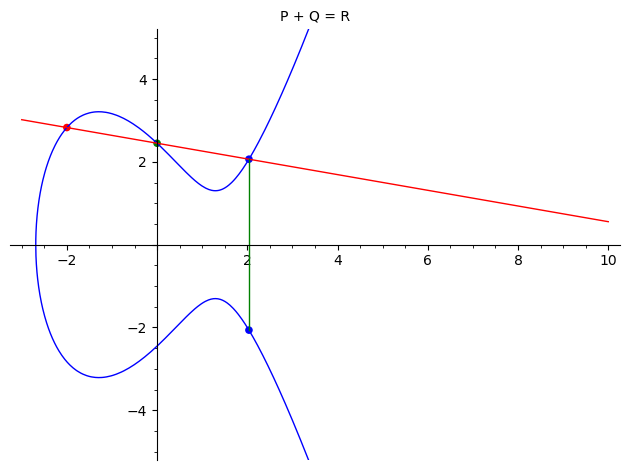
    


### В качестве наглядного примера можно посмотреть на эллиптическую кривую, но уже над полем рациональных чисел.


```python
E = EllipticCurve(QQ, [0, 3])
print(E)
P = E((1, 2))
print(P)
print(P + P)
Q = P + P
print(Q + P)
```

    Elliptic Curve defined by y^2 = x^3 + 3 over Rational Field
    (1 : 2 : 1)
    (-23/16 : -11/64 : 1)
    (1873/1521 : -130870/59319 : 1)


# Чуть дальше чем действительные числа

$E(F_p) = \{(x, y) | x, y \in F_p, y^2 = x^3 + a * x + b\}$

$F_p$ - некоторое конечное поле порядка $p$. В общем случае $p = q^e$, но мы рассмотрим только вариант, когда $e = 1$.


```python
p = 11
Fp = GF(p)
E = EllipticCurve(Fp, [1, 2])
E.plot()
```


    
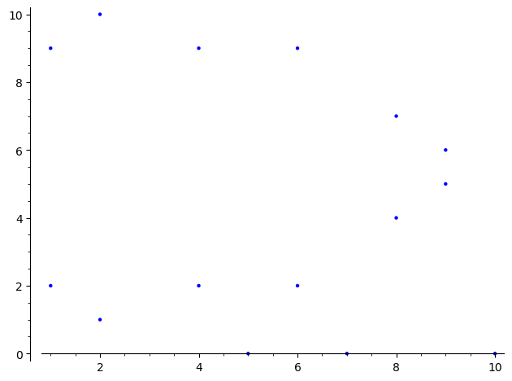
    


```python
p = 17
Fp = GF(p)
E = EllipticCurve(Fp, [0, 3])
E.plot(title="y^2 = x^3 + 3 (mod 17)").show()
P = E.lift_x(1)
Q = E.lift_x(4)

R = (P + Q)
xr, yr = R.xy()

l = (Integer(P[1]) - Integer(Q[1])) / (Integer(P[0]) - Integer(Q[0]))

x = var('x')
y1 = l * (x - Integer(P[0])) + Integer(P[1])
y2 = y1

P = point([int(P[0]), int(P[1])], color='red', size=30)
Q = point([int(Q[0]), int(Q[1])], color='green', size=30)
Rn = point([int(R[0]), int(-R[1])], size=30)
R = point([int(R[0]), int(R[1])], size=30)

resplot = E.plot(title='P + Q = R') + P + Q + R + Rn
resplot += y1.plot(xmin=0, xmax=17, color='red') 

y0 = y1(x=p)
while True:
    if y1(x=p) < p:
        y1 += y1(x=p) - y1(x=0)
    else:
        t = (y1 - p).roots()[0][0]
        y1 -= y1(x=t)

    if y1(x=int(xr)) == Integer(-yr):
        resplot += y1.plot(ymin=0, xmin=0, xmax=int(xr), color='red')
        break
    else:
        resplot += y1.plot(ymin=0,xmin=0, xmax=p, ymax=p, color='red') 

resplot += line([(int(xr), int(yr)), (int(xr), int(-yr))], color='green')
resplot.show()

a = [x.xy() for x in list(E)[1:]]
b = []
for x0, x1 in a:
    b.append((int(x0) + 17, int(x1)))
    b.append((int(x0), int(x1) + 17))
    b.append((int(x0) + 17, int(x1) + 17))
    b.append((int(x0) + 34, int(x1)))
    b.append((int(x0) + 34, int(x1) + 17))

R = point([int(xr) + 34, int(yr) + 17], size=30)
Rn = point([int(xr) + 34, 17 - int(yr) + 17], size=30)
resplot = list_plot(a + b, title='P + Q = R') + P + Q + R + Rn
resplot += y2.plot(xmin=0, xmax=int(xr)+34, color='red') 
resplot += line([(int(xr) + 34, int(yr) + 17), (int(xr) + 34, int(-yr) + 17)], color='green')
resplot += line([(17, 0), (17, 34)], color='black')
resplot += line([(34, 0), (34, 34)], color='black')
resplot += line([(51, 0), (51, 34)], color='black')
resplot += line([(0, 17), (51, 17)], color='black')
resplot += line([(0, 34), (51, 34)], color='black')


resplot
```


    
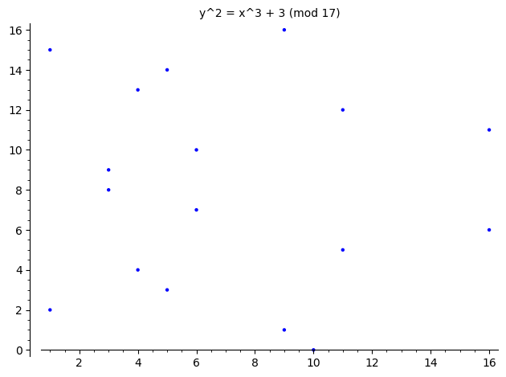
    


    
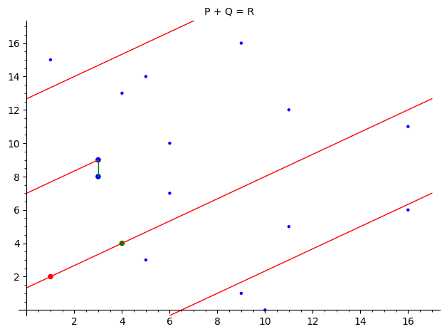
    


    
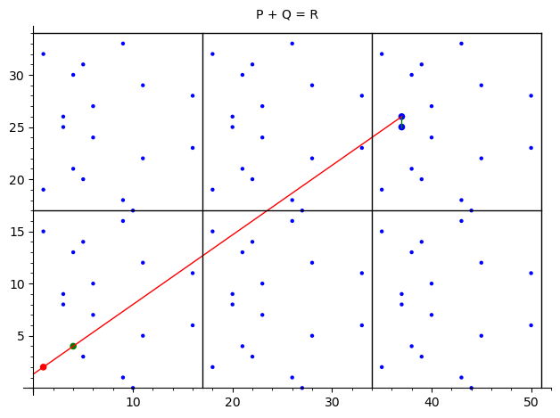
    


## Задача дискретного логарифма

$Q = P + P + P + ... + P = k * P$

Задача дискретного логарифма - по заданным P, Q найти k.


```python
def add_points(P1, P2):
    pass # your code here
    
def double_point(P):
    pass # your code here

x, y = var('x y')
P = (x, y)
P2 = double_point(P)
P4 = double_point(P)
P5 = add_points(P, P4)
```

## Порядок кривой

Как и с группами, порядок - количество элементов в группе. В общем случае он отличается от порядка поля.

$|E(F_p)| = n$

Так же у каждой точки есть свой порядок.

$r = ord(G)$ для наименьшего такого $r: r * G = O$

Так же выделяют подгруппы порядка $r$: $E(F_p)[r] = \{P \in E(F_p) | r * P = O\}$


```python
p = random_prime(2**178)
a = randint(1, p-1)
b = randint(1, p-1)
E = EllipticCurve(GF(p), [a, b])

G = E.random_point()

print(E)
print(f'|E| = {E.order()} = {factor(E.order())}')
print(f'ord(G) = {factor(G.order())}')

assert E.order() * G == E((0, 1, 0))
assert G.order() * G == E((0, 1, 0))
assert E.order() % G.order() == 0
```

    Elliptic Curve defined by y^2 = x^3 + 240851292642111434592258740399517926880756487585657960*x + 85985700257409910657488865864859181845273517914476811 over Finite Field of size 260725031160286220211158041776798992663644669716218573
    |E| = 260725031160286220211158041360294738060303313692918308 = 2^2 * 3 * 109 * 13816677759355733 * 14426844647457075389448414477500147
    ord(G) = 3 * 109 * 13816677759355733 * 14426844647457075389448414477500147


## Вычисление результата умножения точки на скаляр

Мы рассмотрим два подхода
Для Q = O

1. Представим n в бинарном виде. Обрабатывая по очереди биты начиная с верхних:
    - Q = double(Q)
    - Если бит = 1 то дополнительно надо сделать Q = Q + P

Что делать если в бинарном представлении n встречаются длинные подпоследовательности из единиц "...0(1111...1111)0...". В предыдущем алгоритме это бы вылилось в большое количество операций Q + P. Но от них можно избавиться.

$1 + 2 + 2^2 + ... + 2^k = 2^{k + 1} - 1$ - то есть мы можем заменять любые последоавтельности из единиц длины больше 1 [0, 1, 1, 1, 1, 1 ,1 , 1, 1, ..., 1, 1, 0] -> [1, 0, 0, 0, ,0 ,0 ,0 ,0 ,0 ,...,0 ,-1 ,0]


```python
def scalar_multiplication_binary(P, n):
    pass # your code here
    
def scalar_multiplication_ternary(P, n):
    pass # your code here

P = E.random_point()

n = randint(1, P.order())
Q = n * P
Q1 = scalar_multiplication_binary(P, n)
Q2 = scalar_multiplication_ternary(P, n)

assert Q == Q1
assert Q == Q2
```
